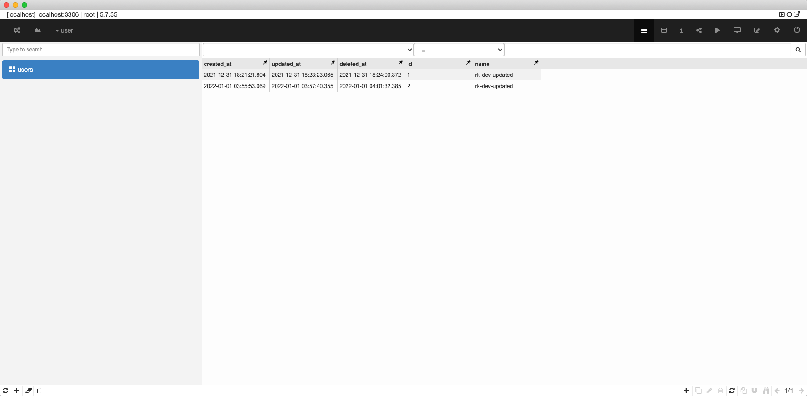

# rk-db/mysql

Init [gorm](https://github.com/go-gorm/gorm) or [go-sqlmock](github.com/DATA-DOG/go-sqlmock) from YAML config.

This belongs to [rk-boot](https://github.com/rookie-ninja/rk-boot) family. We suggest use this lib from [rk-boot](https://github.com/rookie-ninja/rk-boot).

<!-- START doctoc generated TOC please keep comment here to allow auto update -->
<!-- DON'T EDIT THIS SECTION, INSTEAD RE-RUN doctoc TO UPDATE -->
**Table of Contents**  *generated with [DocToc](https://github.com/thlorenz/doctoc)*

- [rk-db/mysql](#rk-dbmysql)
  - [Supported bootstrap](#supported-bootstrap)
  - [Supported Instances](#supported-instances)
  - [Installation](#installation)
  - [Quick Start](#quick-start)
    - [0.Import rk-boot/gin as web framework to use](#0import-rk-bootgin-as-web-framework-to-use)
    - [1.Create boot.yaml](#1create-bootyaml)
    - [2.Create main.go](#2create-maingo)
    - [3.Start server](#3start-server)
    - [4.Validation](#4validation)
      - [4.1 Create user](#41-create-user)
      - [4.1 Update user](#41-update-user)
      - [4.1 List users](#41-list-users)
      - [4.1 Get user](#41-get-user)
      - [4.1 Delete user](#41-delete-user)
  - [YAML Options](#yaml-options)
    - [Usage of locale](#usage-of-locale)

<!-- END doctoc generated TOC please keep comment here to allow auto update -->

## Supported bootstrap
| Bootstrap | Description |
| --- | --- |
| YAML based | Start [gorm](https://github.com/go-gorm/gorm) or [go-sqlmock](github.com/DATA-DOG/go-sqlmock) from YAML |
| Code based | Start [gorm](https://github.com/go-gorm/gorm) or [go-sqlmock](github.com/DATA-DOG/go-sqlmock) from code |

## Supported Instances
All instances could be configured via YAML or Code.

**User can enable anyone of those as needed! No mandatory binding!**

| Instance | Description |
| --- | --- |
| gorm.DB | Compatible with original [gorm](https://github.com/go-gorm/gorm) |
| sqlmock.Sqlmock | Conpatible with original [go-sqlmock](github.com/DATA-DOG/go-sqlmock) |
| Logger | Implementation of [gorm](https://github.com/go-gorm/gorm) wrapped by [uber-go/zap](https://github.com/uber-go/zap) logger |
| HealthCheck | Periodic DB health check every 5 seconds |
| AutoCreation | Automatically create DB and table if missing in MySQL |

## Installation
`go get github.com/rookie-ninja/rk-db/mysql`

## Quick Start
In the bellow example, we will run MySQL locally and implement API of Create/List/Get/Update/Delete for User model with Gin.

- GET /v1/user, List users
- GET /v1/user/:id, Get user
- PUT /v1/user, Create user
- POST /v1/user/:id, Update user
- DELETE /v1/user/:id, Delete user

Please refer example at [example](example).

### 0.Import rk-boot/gin as web framework to use

```
go get github.com/rookie-ninja/rk-boot/gin
```

### 1.Create boot.yaml
[boot.yaml](example/boot.yaml)

- Create web server with Gin framework at port 8080
- Create MySQL entry which connects MySQL at localhost:3306

```yaml
---
gin:
  - name: user-service
    port: 8080
    enabled: true
mySql:
  - name: user-db
    enabled: true
    enableHealthCheck: true
    locale: "*::*::*::*"
    user: root
    pass: pass
    addr: "localhost:3306"
    database: user
    params:
      - "charset=utf8mb4"
      - "parseTime=True"
      - "loc=Local"
```

### 2.Create main.go

In the main() function, we implement two things.

- Add User{} as auto migrate option which will create table in DB automatically if missing.
- Register APIs into Gin router.

```go
package main

import (
	"context"
	"github.com/gin-gonic/gin"
	"github.com/rookie-ninja/rk-boot"
	"github.com/rookie-ninja/rk-boot/gin"
	"github.com/rookie-ninja/rk-db/mysql"
	"gorm.io/gorm"
	"net/http"
	"strconv"
	"time"
)

func main() {
	boot := rkboot.NewBoot(rkboot.WithBootConfigPath("example/boot.yaml"))

	// Add auto migrate
	mysqlEntry := rkmysql.GetMySqlEntry("user-db")
	mysqlEntry.AddAutoMigrate(&User{})

	// Register APIs
	ginEntry := rkbootgin.GetGinEntry("user-service")
	ginEntry.Router.GET("/v1/user", ListUsers)
	ginEntry.Router.GET("/v1/user/:id", GetUser)
	ginEntry.Router.PUT("/v1/user", CreateUser)
	ginEntry.Router.POST("/v1/user/:id", UpdateUser)
	ginEntry.Router.DELETE("/v1/user/:id", DeleteUser)

	boot.Bootstrap(context.TODO())

	boot.WaitForShutdownSig(context.TODO())
}

// *************************************
// *************** Model ***************
// *************************************

type Base struct {
	CreatedAt time.Time      `yaml:"-" json:"-"`
	UpdatedAt time.Time      `yaml:"-" json:"-"`
	DeletedAt gorm.DeletedAt `yaml:"-" json:"-" gorm:"index"`
}

type User struct {
	Base
	Id   int    `yaml:"id" json:"id" gorm:"primaryKey"`
	Name string `yaml:"name" json:"name"`
}

func ListUsers(ctx *gin.Context) {
	userList := make([]*User, 0)
	res := rkmysql.GetMySqlEntry("user-db").GormDB.Find(&userList)

	if res.Error != nil {
		ctx.JSON(http.StatusInternalServerError, res.Error)
		return
	}
	ctx.JSON(http.StatusOK, userList)
}

func GetUser(ctx *gin.Context) {
	uid := ctx.Param("id")
	user := &User{}
	res := rkmysql.GetMySqlEntry("user-db").GormDB.Where("id = ?", uid).Find(user)

	if res.Error != nil {
		ctx.JSON(http.StatusInternalServerError, res.Error)
		return
	}
	ctx.JSON(http.StatusOK, user)
}

func CreateUser(ctx *gin.Context) {
	user := &User{
		Name: ctx.Query("name"),
	}

	res := rkmysql.GetMySqlEntry("user-db").GormDB.Create(user)

	if res.Error != nil {
		ctx.JSON(http.StatusInternalServerError, res.Error)
		return
	}
	ctx.JSON(http.StatusOK, user)
}

func UpdateUser(ctx *gin.Context) {
	uid := ctx.Param("id")
	user := &User{
		Name: ctx.Query("name"),
	}

	res := rkmysql.GetMySqlEntry("user-db").GormDB.Where("id = ?", uid).Updates(user)

	if res.Error != nil {
		ctx.JSON(http.StatusInternalServerError, res.Error)
		return
	}

	// get user
	rkmysql.GetMySqlEntry("user-db").GormDB.Where("id = ?", uid).Find(user)

	ctx.JSON(http.StatusOK, user)
}

func DeleteUser(ctx *gin.Context) {
	uid, _ := strconv.Atoi(ctx.Param("id"))
	res := rkmysql.GetMySqlEntry("user-db").GormDB.Delete(&User{
		Id: uid,
	})

	if res.Error != nil {
		ctx.JSON(http.StatusInternalServerError, res.Error)
		return
	}
	ctx.String(http.StatusOK, "success")
}
```

### 3.Start server

```
$ go run main.go

2022-01-01T04:03:49.377+0800    INFO    boot/gin_entry.go:913   Bootstrap ginEntry      {"eventId": "223fd0e6-dad4-4ff3-9654-0ef90760192e", "entryName": "user-service"}
------------------------------------------------------------------------
endTime=2022-01-01T04:03:49.377377+08:00
startTime=2022-01-01T04:03:49.377287+08:00
elapsedNano=89347
timezone=CST
ids={"eventId":"223fd0e6-dad4-4ff3-9654-0ef90760192e"}
app={"appName":"rk","appVersion":"","entryName":"user-service","entryType":"GinEntry"}
env={"arch":"amd64","az":"*","domain":"*","hostname":"lark.local","localIP":"10.8.0.2","os":"darwin","realm":"*","region":"*"}
payloads={"ginPort":8080}
error={}
counters={}
pairs={}
timing={}
remoteAddr=localhost
operation=Bootstrap
resCode=OK
eventStatus=Ended
EOE
2022-01-01T04:03:49.377+0800    INFO    zapgrpc/zapgrpc.go:99   Bootstrap mysql entry
```

### 4.Validation
#### 4.1 Create user
Create a user with name of rk-dev.

```shell script
$ curl -X PUT "localhost:8080/v1/user?name=rk-dev"
{"id":2,"name":"rk-dev"}
```

#### 4.1 Update user
Update user name to rk-dev-updated.

```shell script
$ curl -X POST "localhost:8080/v1/user/2?name=rk-dev-updated"
{"id":2,"name":"rk-dev-updated"}
```

#### 4.1 List users
List users.

```shell script
$ curl -X GET localhost:8080/v1/user
[{"id":2,"name":"rk-dev-updated"}]
```

#### 4.1 Get user
Get user with id=2.

```shell script
$ curl -X GET localhost:8080/v1/user/2
{"id":2,"name":"rk-dev-updated"}
```

#### 4.1 Delete user

```shell script
$ curl -X DELETE localhost:8080/v1/user/2
success
```



## YAML Options
User can start multiple [gorm](https://github.com/go-gorm/gorm) instances at the same time. Please make sure use different names.

| name | Required | description | type | default value |
| ------ | ------ | ------ | ------ | ------ |
| mysql.name | Required | The name of entry | string | MySql |
| mysql.enabled | Required | Enable entry or not | bool | false |
| mysql.locale | Required | See locale description bellow | string | "" |
| mysql.description | Optional | Description of echo entry. | string | "" |
| mysql.enableMockDb | Optional | Create [go-sqlmock](github.com/DATA-DOG/go-sqlmock) instead of [gorm](https://github.com/go-gorm/gorm) for unit test, see [detail](https://github.com/DATA-DOG/go-sqlmock#tests-with-sqlmock) | bool | false |
| mysql.enableHealthCHeck | Optional | Periodic DB health check every 5 seconds, error will be logged | bool | false |
| mysql.user | Optional | MySQL username | string | root |
| mysql.pass | Optional | MySQL password | string | pass |
| mysql.protocol | Optional | Connection protocol to MySQL | string | tcp |
| mysql.addr | Optional | MySQL remote address | string | localhost:3306 |
| mysql.params | Optional | Parameters while conneting to MySQL | []string | [] |
| mysql.loggerEncoding | Optional | Log encoding type, json & console are available options | string | console |
| mysql.loggerOutputPaths | Optional | Output paths of logger | []string | [stdout] |

### Usage of locale

```
RK use <realm>::<region>::<az>::<domain> to distinguish different environment.
Variable of <locale> could be composed as form of <realm>::<region>::<az>::<domain>
- realm: It could be a company, department and so on, like RK-Corp.
         Environment variable: REALM
         Eg: RK-Corp
         Wildcard: supported

- region: Please see AWS web site: https://docs.aws.amazon.com/AWSEC2/latest/UserGuide/using-regions-availability-zones.html
          Environment variable: REGION
          Eg: us-east
          Wildcard: supported

- az: Availability zone, please see AWS web site for details: https://docs.aws.amazon.com/AWSEC2/latest/UserGuide/using-regions-availability-zones.html
      Environment variable: AZ
      Eg: us-east-1
      Wildcard: supported

- domain: Stands for different environment, like dev, test, prod and so on, users can define it by themselves.
          Environment variable: DOMAIN
          Eg: prod
          Wildcard: supported

How it works?
First, we will split locale with "::" and extract realm, region, az and domain.
Second, get environment variable named as REALM, REGION, AZ and DOMAIN.
Finally, compare every element in locale variable and environment variable.
If variables in locale represented as wildcard(*), we will ignore comparison step.

Example:
# let's assuming we are going to define DB address which is different based on environment.
# Then, user can distinguish DB address based on locale.
# We recommend to include locale with wildcard.
---
DB:
  - name: redis-default
    locale: "*::*::*::*"
    addr: "192.0.0.1:6379"
  - name: redis-in-test
    locale: "*::*::*::test"
    addr: "192.0.0.1:6379"
  - name: redis-in-prod
    locale: "*::*::*::prod"
    addr: "176.0.0.1:6379"
```


